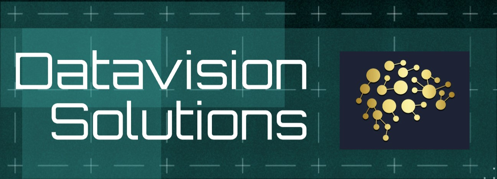
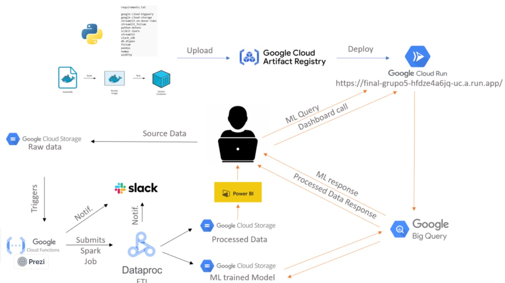
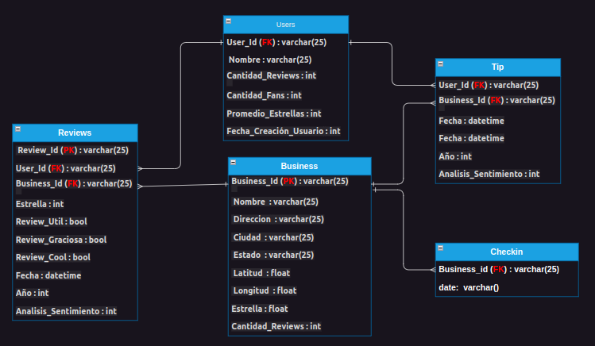
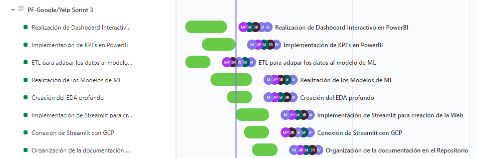
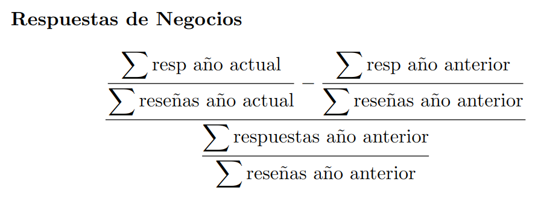
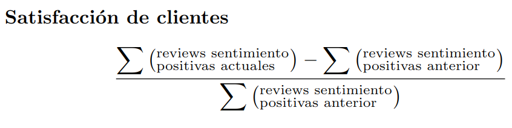
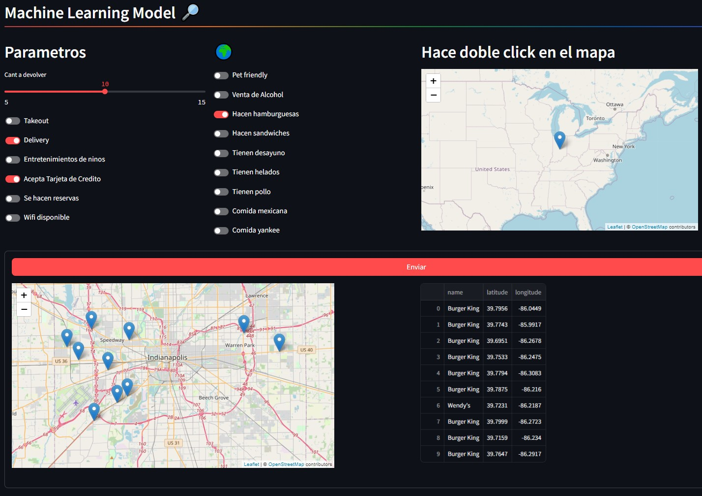

# 

# <h1 align="center">*Recomendación de negocios*</h1>

  

## *Índice de Contenidos*

- [Introducción](#introducción)
- [Contexto](#contexto)
- [Alcance](#alcance)
  - [Flujo de Trabajo](#flujo-de-trabajo)
  - [Cronograma](#cronograma)
  - [DER](#diagramas-entidad-relación)
  - [Diagrama de Gantt](#diagrama-de-gantt)
  - [KPIs](#kpis)
  - [Restricciones y Limitaciones](#restricciones-y-limitaciones)
- [Dashboard](#dashboard-interactivo)
- [Modelo-Recomendación](#modelo-de-recomendación)  
- [Fuentes de datos](#fuentes-de-datos)
- [Acerca de nosotros](#acerca-de-nosotros)
- [Stack tecnológico](#stack-tecnológico)

## *Introducción*

Como parte de una consultora de datos, hemos sido contratados para llevar a cabo un análisis del mercado estadounidense. Nuestro cliente forma parte de un conglomerado de empresas relacionadas con restaurantes relacionadas al rubro fast food, y buscan obtener un análisis detallado de las opiniones de los usuarios en Yelp y cruzarlas con las de Google Maps en relación a dicho rubro. Utilizando análisis de sentimientos, nuestro objetivo es prever si el rubro fast food experimentará un mayor crecimiento o declive.

Además nuestro cliente desea determinar estratégicamente la ubicación de nuevos locales de restaurantes, implementando un sistema de recomendación de restaurantes fast food para usuarios en ambas plataformas. Con nuestro producto los clientes podran identificar oportunidades de creación o compra de negocios.

## Contexto

La retroalimentación de los usuarios, cada vez más abundante gracias a plataformas de reseñas, es un recurso valioso para los negocios de comida rápida. Yelp y Google Maps son dos plataformas destacadas que ofrecen reseñas específicamente para este tipo de establecimientos. Los usuarios comparten sus experiencias, proporcionando a las empresas de comida rápida una visión detallada de cómo son percibidas por sus clientes. Esta información resulta esencial para evaluar el rendimiento, utilidad y áreas de mejora de los servicios ofrecidos por cada local de comida rápida. La capacidad de los usuarios para tomar decisiones basadas en estas reseñas subraya la importancia crítica de mantener una imagen positiva en estas plataformas para el éxito comercial en la industria de la comida rápida.

## Alcance

El presente documento establece el alcance del proyecto de análisis de opiniones de usuarios

### Flujo de Trabajo

  

## Cronograma

El proyecto se desarrollará en un período de 6 semanas, con tres sprint que son los siguientes:

- Sprint 1: Puesta en macha del proyecto. 2 Semanas

  - Inicialización del proyecto realizando mineria de datos y documentación del datawarehouse.
  - Establecimiento del stack tecnologica que utilzaremos durante el proyecto.
  - Implementamos la metodología SCRUM realizando daylis, para optimizar la producción.
  - Realización de tareas puntuales como EDA, KPI's y diagrama de Gantt.
  - Equipo de trabajo, Roles y responsabilidades.
- Sprint 2: Data Engineering. 2 Semanas
  - Realización de extracción transformación y carga de la data.
  - Creación de un flujo automatizado anual, en el que nuestro cliente podra estar actualizado de forma automatica.
  - Durante la creación del flujo automatico se nos notificará via el slack de la empresa las valizaciones de la tarea de manera automatica.
  - Documentación: Diagrama entidad relación, Diccionario de datos, Workflow y tecnologías.
  - MVP/ Proof of Concept de producto de ML ó MVP/ Proof of Concept de Dashboard.
- Sprint 3: Data Analitics y Machine learning. 2 Semanas.
  - Diseño de Dashboard realizado en power BI, vizualizado en la página web de la empresa.
  - Creación de un modelo de recomendación para nuestro cliente y puesta en producción en la página web.
  - Documentación: selección del modelo, feature engineering, informe de análisis.
  - Video del proyecto realizado, para ser votado y, en caso de ganar, ser presentado en la graduación final.

### Diagramas entidad relación

### Diagrama de Gantt

El proyecto seguirá una metodología de trabajo en equipo que incluye las siguientes etapas:

Sprint 1

  

Sprint 2

  

Sprint 3

  

### *KPIs*

 <b>Objetivo:</b> Aumentar las respuestas de negocios en un 45% respecto al año anterior.

 
<b>Objetivo:</b> Aumentar un 10% las reviews positivas comparadas con el año anterior.

(Una review positiva es cuando recibe 4 o 5 estrellas)

 
<b>Objetivo:</b> Aumentar un 5% los reviews de sentimientos positivos respecto
  
 al total de reviews comparados con el año anterior.

### *Restricciones y Limitaciones*

El proyecto se limita al análisis de datos disponibles en Yelp y Google Maps para el mercado estadounidense.
La disponibilidad y calidad de los datos pueden afectar los resultados del análisis.
El alcance del proyecto no incluye la implementación de sistemas en producción, sino la entrega de modelos y recomendaciones listos para su implementación.

(<a href="#readme-top">ir arriba</a>)

## Deploy en Streamlit

Realizamos una página web interactiva a través de la herramienta streamlit mediante el cual presentamos nuestros productos desarrollados como son un dashboard y un modelo de recomendación. 

<a href="https://datavision-hfdze4a6jq-uc.a.run.app/">Link Página web</a>

<!-- 

  
  

  
  

 -->

  
  

  
  

## Dashboard Interactivo
Desarrollamos un dashboard interactivo que brinda información gráfica y detallada de nuestros análisis que permite visualizar de manera clara y concisa los insights obtenidos durante el proceso de análisis de mercado.

  

## Modelo de recomendación

 Nuestro modelo predictivo de machine learning con base en la proximidad geográfica, la evaluación de usuarios y la oferta de servicios, devuelve recomendaciones valiosas acerca de los negocios de comida rápida en Estados unidos.

  

## *Fuentes de datos*

- [Diccionario de Datos](https://docs.google.com/document/d/1JyRMQQJPGitQEPz7D5zgcfMOSEScAjzd-6Sq229kZZQ/edit)

### Fuentes de datos obligatorias

- [Dataset de Google Maps](https://drive.google.com/drive/folders/1Wf7YkxA0aHI3GpoHc9Nh8_scf5BbD4DA?usp=share_link)

- [Dataset de Yelp!](https://drive.google.com/drive/folders/1TI-SsMnZsNP6t930olEEWbBQdo_yuIZF?usp=sharing)

## *Acerca de nosotros*

<table align="center">
  <tr>
    <td align="center"><b>Marcelo Ortiz</td>
    <td align="center"><b>Belén Viglioglia Becker</b></td>
    <td align="center"><b>Alejandro Ramírez</b></td>
    <td align="center"><b>Mariano Popov</b></td>
    <td align="center"><b>Martín Riveros</b></td>
  </tr>
  <tr>
    <td align="center"></td>
    <td align="center"></td>
    <td align="center"></td>
    <td align="center"></td>
    <td align="center"></td>
  </tr>
  <tr>
    <td align="center">Data Analyst</td>
    <td align="center">Data Analyst</td>
    <td align="center">Data Engineer</td>
    <td align="center">Data Engineer</td>
    <td align="center">Data Science</td>
  </tr>
  <tr>
    <td align="center"></td>
    <td align="center"></td>
    <td align="center"></td>
    <td align="center"></td>
    <td align="center"></td>
  </tr>
  <tr>
      <td align="center"></td>
    <td align="center"></td>
    <td align="center"></td>
    <td align="center"></td>
    <td align="center"></td>
  </tr>
</table>

(<a href="#readme-top">ir arriba</a>)

## Stack tecnológico 

 
 
 
 
 
 
 
 
 
 
 
 
 

