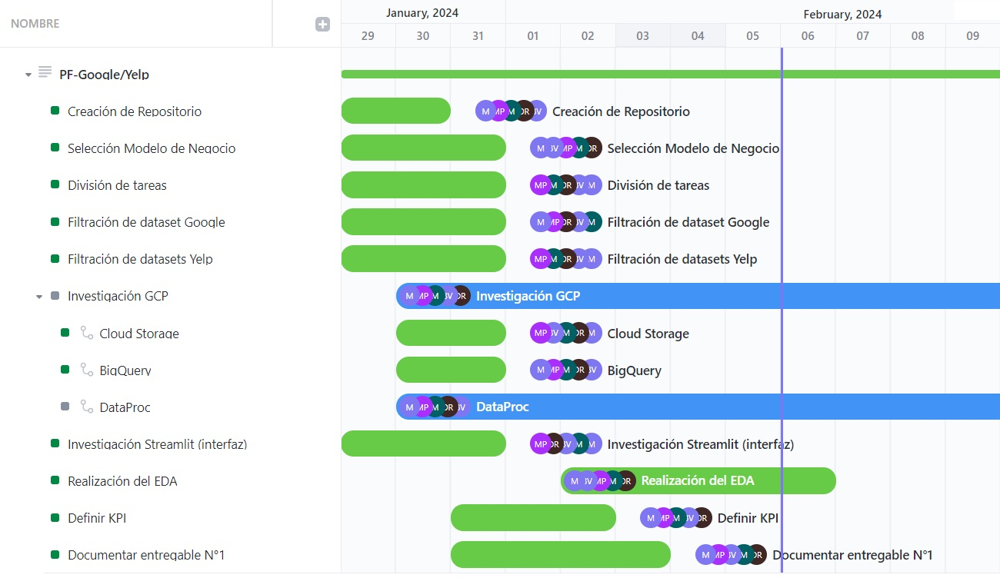
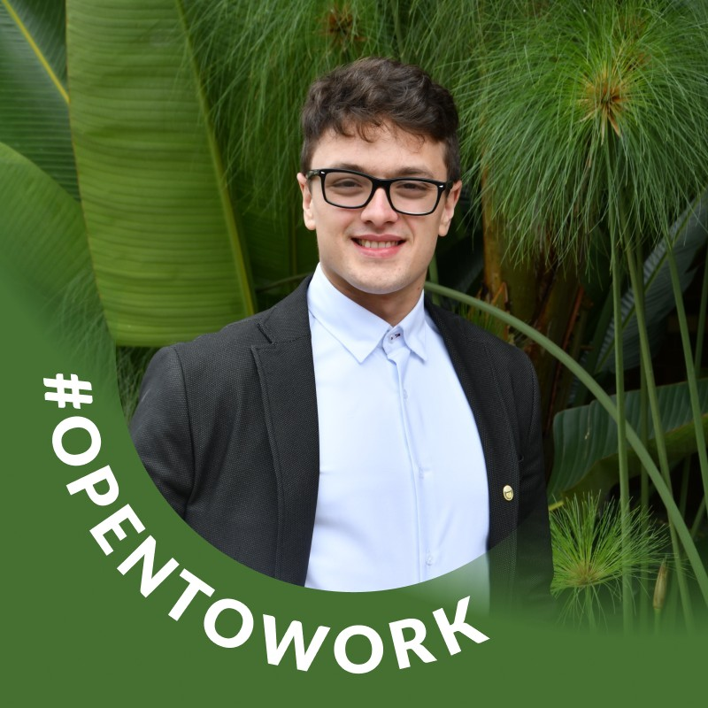

# 

# <h1 align="center">*GOOGLE MAPS_YELP - RECOMMENDATIONS*</h1>

## *Índice de Contenidos*

- [Introducción](#introducción)
- [Contexto](#contexto)
- [Alcance](#alcance)
  - [Cronograma](#cronograma)
  - [Diagrama de Gantt](#diagrama-de-gantt)
  - [KPIs](#kpis)
  - [Restricciones y Limitaciones](#restricciones-y-limitaciones)
- [Entregables](#entregables)
- [Stack tecnológico](#stack-tecnológico)
- [Fuentes de datos](#fuentes-de-datos)
- [Acerca de nosotros](#acerca-de-nosotros)

## *Introducción*

Como parte de una consultora de datos, hemos sido contratados para llevar a cabo un análisis del mercado estadounidense. Nuestro cliente forma parte de un conglomerado de empresas relacionadas con restaurantes relacionadas al rubro fast food, y buscan obtener un análisis detallado de las opiniones de los usuarios en Yelp y cruzarlas con las de Google Maps en relación a dicho rubro. Utilizando análisis de sentimientos, nuestro objetivo es prever si el rubro fast food experimentará un mayor crecimiento o declive.

Además nuestro cliente desea determinar estratégicamente la ubicación de nuevos locales de restaurantes, implementando un sistema de recomendación de restaurantes fast food para usuarios en ambas plataformas. Este sistema ofrecería a los usuarios la oportunidad de descubrir nuevos sabores basados en sus experiencias previas

## Contexto

La retroalimentación de los usuarios, cada vez más abundante gracias a plataformas de reseñas, es un recurso valioso para los negocios de comida rápida. Yelp y Google Maps son dos plataformas destacadas que ofrecen reseñas específicamente para este tipo de establecimientos. Los usuarios comparten sus experiencias, proporcionando a las empresas de comida rápida una visión detallada de cómo son percibidas por sus clientes. Esta información resulta esencial para evaluar el rendimiento, utilidad y áreas de mejora de los servicios ofrecidos por cada local de comida rápida. La capacidad de los usuarios para tomar decisiones basadas en estas reseñas subraya la importancia crítica de mantener una imagen positiva en estas plataformas para el éxito comercial en la industria de la comida rápida.

<h2>Alcance</h2>

El presente documento establece el alcance del proyecto de análisis de opiniones de usuarios

### Objetivos del Proyecto

### Diagrama de Gantt

El proyecto seguirá una metodología de trabajo en equipo que incluye las siguientes etapas:

### *KPIs*

- **Respuestas de negocios**

$$\frac{\frac{\text{$\sum$ resp mes actual}}{\text{$\sum$ reseñas mes actual}} - \frac{\text{$\sum$ resp mes anterior}}{\text{$\sum$ reseñas mes anterior}} }{\frac{\text{$\sum$ resp mes anterior}}{\text{$\sum$ reseñas mes anterior}}}
$$

 <b>Objetivo:</b> Aumentar las respuestas de negocios en un 3% respecto al mes anterior.

----------------------
<!-- - **Evolución de la Cantidad de negocios**

$$\frac{\text{$\sum$ business actual} - \text{$\sum$ business anterior} }{\text{$\sum$  business anterior}}
$$

 
<b>Objetivo:</b> Queremos aumentar las respuestas de negocios en un 10% respecto al año anterior.

----------------- -->

- **Cantidad de Rating positivos**
  $$\frac{\sum \text{(reviews positivas actuales)} - \sum\text{(reviews positivas año anterior)}}{\sum\text{(reviews positivas año anterior)}}$$

 

 
<b>Objetivo:</b> Aumentar un 10% las reviews positivas comparadas con el año anterior.

(Una review positiva es cuando recibe 4 o 5 estrellas)

--------

- **Densidad de area de negocio (por Estado)**

  $$Ratio_{area}  = \frac{\sum \text{(business actual)} }{\text{Área estado}}$$

  
 <b>Objetivo:</b> Aumentar un 5% el ratio de negocios abiertos  en un estado en función de su área, respecto al ratio del año anterior.

--------------------

- **Satisfacción de clientes**

    $$\frac{\sum{reviews(_{positivos}^{sentimiento})}}{\sum{reviews}}$$

 
<b>Objetivo:</b> Aumentar un 5% los reviews de sentimientos positivos respecto al total de reviews comparados con el semestre anterior.

--------------------

### *Entregables*

### *Restricciones y Limitaciones*

El proyecto se limita al análisis de datos disponibles en Yelp y Google Maps para el mercado estadounidense.
La disponibilidad y calidad de los datos pueden afectar los resultados del análisis.
El alcance del proyecto no incluye la implementación de sistemas en producción, sino la entrega de modelos y recomendaciones listos para su implementación.

(<a href="#readme-top">ir arriba</a>)

### *Stack tecnológico*

- 
- 
- 
- 
- 
- 
- 
- 
- 
- 
- 
- 
- 

## Cronograma

El proyecto se desarrollará en un período de 6 semanas, con tres sprint que son los siguientes:

- Sprint 1: Puesta en macha del proyecto. 2 Semanas

- Sprint 2: Data Engineering. 2 Semanas

- Sprint 3: Data Analitics y Machine learning. 2 Semanas.

## *Fuentes de datos*

- [Diccionario de Datos](https://docs.google.com/document/d/1JyRMQQJPGitQEPz7D5zgcfMOSEScAjzd-6Sq229kZZQ/edit)

### Fuentes de datos obligatorias:
- [Dataset de Google Maps](https://drive.google.com/drive/folders/1Wf7YkxA0aHI3GpoHc9Nh8_scf5BbD4DA?usp=share_link)

- [Dataset de Yelp!](https://drive.google.com/drive/folders/1TI-SsMnZsNP6t930olEEWbBQdo_yuIZF?usp=sharing)

## *Acerca de nosotros*

Completar ..... 

[linkedin-logo]: https://img.shields.io/badge/LinkedIn-0077B5?style=for-the-badge&logo=linkedin&logoColor=whiteLogoDelDi%CC%81a-LinkedIn-un-emblema-que-esta%CC%81-22dentro22-1110x366.jpg

[github-logo]: https://img.shields.io/badge/Platform-GitHub-lightgrey

[github-belen]:https://github.com/belenvbecker

[github-mariano]:https://github.com/marianopopov

[github-martin]: https://github.com/martinarielriveros

[github-alejo]: https://github.com/dalejandroramirez

[github-marcelo]: https://github.com/marceloortizz

[linkedin-belen]: https://www.linkedin.com/in/belen-viglioglia-becker/

[linkedin-mariano]: https://www.linkedin.com/in/mariano-popov-3a4570290/

[linkedin-martin]: https://www.linkedin.com/in/martinriveros/

[linkedin-alejo]: https://www.linkedin.com/in/dalejandroramirez/

[linkedin-marcelo]: https://www.linkedin.com/in/marceloortizz/

<table align="center">
  <tr>
    <td align="center"><b>Marcelo Ortiz</td>
    <td align="center"><b>Belén Viglioglia Becker</b></td>
    <td align="center"><b>Alejandro Ramírez</b></td>
    <td align="center"><b>Mariano Popov</b></td>
    <td align="center"><b>Martín Riveros</b></td>
  </tr>
  <tr>
    <td align="center"></td>
    <td align="center"></td>
    <td align="center"></td>
    <td align="center"></td>
    <td align="center"></td>
  </tr>
  <tr>
    <td align="center">Data Analyst</td>
    <td align="center">Data Analyst</td>
    <td align="center">Data Engineer</td>
    <td align="center">Data Engineer</td>
    <td align="center">Data Science</td>
  </tr>
  <tr>
    <td align="center"></td>
    <td align="center"></td>
    <td align="center"></td>
    <td align="center"></td>
    <td align="center"></td>
  </tr>
</table>

